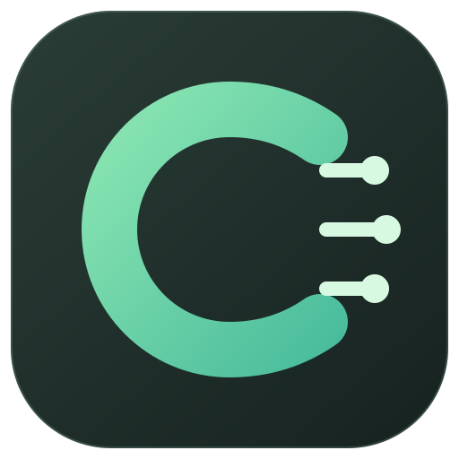

# codex-cpa-bridge



`codex-cpa-bridge` is a local control plane for CPA-backed Codex, Claude Code, and xbot model visibility. The CLI is the source of truth; the desktop UI invokes it.

It deliberately treats CPA as a black box. TraeX bridge, upstream OAuth, account pools, retry policy,
model routing, and gateway internals belong to CPA and are outside this tool's scope.

## Goals

- Keep the normal Codex home, usually `~/.codex`, available for native ChatGPT login.
- Create and validate a separate CPA-backed `CODEX_HOME`.
- Render a Codex `model_provider` that points at CPA through the Responses wire API.
- Manage the isolated profile's model catalog and preview/sync CPA-backed model visibility across supported local clients.
- Check the local CPA endpoint with bounded black-box probes.
- Check the loopback SSH entrypoint used by Codex Desktop or a remote host.

## Non-goals

- Do not copy, parse, or link the main `auth.json`.
- Do not modify the official Codex profile or unrelated Claude/xbot providers.
- Do not manage CPA internals or TraeX bridge.
- Do not store secrets in the manifest, command line, generated config, or logs.

## Quick Start

Prerequisites: Go 1.27+, a running CPA-compatible service, an existing CPA-backed Codex profile with `model_catalog_json`, and `sqlite3` for local xbot model sync. The desktop UI also requires Node.js and a Rust toolchain.

```sh
git clone https://github.com/matto49/codex-cpa-bridge.git
cd codex-cpa-bridge
make build
./bin/bridge-go --manifest ~/.config/codex-cpa-bridge/bridge.toml init --json
./bin/bridge-go --manifest ~/.config/codex-cpa-bridge/bridge.toml init --write
./bin/bridge-go --manifest ~/.config/codex-cpa-bridge/bridge.toml doctor --json
./bin/bridge-go --manifest ~/.config/codex-cpa-bridge/bridge.toml platforms plan --json
```

`init` discovers an existing CPA-backed Codex profile (from `CODEX_HOME`, `~/.codex-mac-cpa`, or `~/.codex-cpa`) and creates a private manifest without changing the profile. It refuses to overwrite a manifest. If no profile is found, configure one first or copy `examples/mac.toml` or `examples/devbox.toml` to your private manifest path, then replace `YOUR_CPA_MODEL`, `YOUR_USERNAME`, and the credential reference. The examples are templates, not ready-to-run credentials or host configurations.

For a fresh profile without a model catalog, after editing the private manifest and starting CPA, run `models bootstrap --json` to preview, then `models bootstrap --write --json` to create the catalog. This requires CPA to return full Codex model metadata; it refuses incomplete metadata and never overwrites an existing catalog. Then run `setup` to render the profile and configure loopback SSH. If the CPA profile is externally managed, point its `model_catalog_json` at the created file yourself.

The project has one implementation: the Go CLI in `cmd/bridge`.
Keep machine-specific configuration in a private manifest; the repository ignores a root-level `bridge.toml` and local `.qa/` artifacts.

The default manifest path is `./bridge.toml`. If it does not exist, the CLI uses conservative defaults:

- official profile: `~/.codex`
- CPA profile: `~/.codex-cpa`
- CPA endpoint: `http://127.0.0.1:8317/v1`
- SSH endpoint: `127.0.0.1:2222`

## Manifest

```toml
[profiles.official]
home = "~/.codex"
mode = "native"
managed = false
# Mac/Desktop should keep this true so normal ChatGPT login remains native.
# Devbox/headless profiles that intentionally default to CPA can set it false.
enforce_native_login = true

[profiles.cpa]
management = "managed" # or "external" to preserve an existing config.toml
home = "~/.codex-cpa"
endpoint = "http://127.0.0.1:8317/v1"
model = "gpt-5.6-sol"
provider_name = "cpa-local"
# Optional catalog controlled by `bridge models` and the desktop UI.
model_catalog_json = "~/.codex-cpa/model-catalogs/cpa.json"
# Optional: reference a local helper or env var; never put the token itself here.
auth_command = "/path/to/local-token-helper"
# env_key = "CPA_API_KEY"

[ssh.cpa]
management = "managed" # or "external" to validate an existing sshd without controlling it
host = "127.0.0.1"
port = 2222
user = "your-user"
profile = "cpa"
# Optional: used by diagnostics when probing the loopback sshd.
identity_file = "~/.ssh/id_ed25519"

[runtime]
state_dir = "~/.codex-cpa-bridge"
codex_binary = "codex"
app_server_args = ["app-server"]
```

## Commands

- `bridge setup`: configure the isolated Codex profile and loopback sshd, start it, then verify an authenticated SSH probe. Add `--generate-bridge-key` to create a dedicated client key when no bridge key or explicit `identity_file` exists; it does not replace existing keys or work on externally managed SSH endpoints.
- `bridge models list --json`: list model display names, visibility, API support, and priority for the UI.
- `bridge models bootstrap [--write] --json`: preview or create a missing catalog from CPA's complete Codex metadata; never overwrite an existing catalog.
- `bridge models set --slug MODEL --visibility list|hide`: change whether one catalog model is shown, with a backup.
- `bridge models refresh --json`: add newly advertised CPA models to the existing catalog without resetting hidden models; creates a backup only when changed.
- `bridge platforms scan --json`: discover Codex, Claude Code, and xbot configuration sources without outputting credentials.
- `bridge platforms init-claude --base-url URL --json`: preview a private Claude settings file only when it is absent. Pass the Anthropic base URL without a final `/v1` (Claude Code appends `/v1/messages`); an accidentally included final `/v1` is removed automatically. Add `--confirm-anthropic-compatible --confirm-external-auth --write` to create it after you have verified CPA's Anthropic API and provided Claude credentials outside this file. It never converts or overwrites an unrelated relay.
- `bridge platforms plan --json`: preview model additions/removals and blocked or unrelated platforms; read-only.
- `bridge platforms sync --json`: back up and apply changes to CPA-backed Claude settings and xbot subscription rows. Codex reads the source catalog directly. The JSON report names each platform's outcome and backup path; the command exits nonzero for blocked/failed platforms.
- `bridge remote scan --target SSH_ALIAS --json`: resolve the actual SSH host and verify authenticated SSH, remote bridge installation, Codex home, and authenticated CPA health.
- `bridge remote sync --target SSH_ALIAS --json`: preview visibility differences against a ready remote bridge. Add `--write` to refresh its CPA catalog, apply matching visibility, then sync remote platforms. Models absent from remote CPA are reported as unavailable, never reported as synchronized.
- `bridge remote install --target SSH_ALIAS --binary bin/bridge-go-linux-amd64 --json`: upload a prebuilt Linux/amd64 CLI after backing up an existing binary, initialize a missing remote manifest, and run remote doctor. Add `--setup` to configure the remote bridge-owned loopback SSH endpoint and create a dedicated client key when no bridge key or explicit identity is configured. Build the binary with `make remote-binary`. The installer never copies local credentials; a new host still needs its own CPA credential source and model catalog.
- `bridge init --write`: auto-detect an existing CPA Codex profile and create a new private manifest at `--manifest`.
- `bridge doctor`: report profile isolation, generated config drift, CPA black-box health, and SSH readiness.
- `bridge status`: compact status output for humans and scripts.
- `bridge render`: print the CPA Codex config that would be written.
- `bridge render --write`: atomically write the CPA profile config after backing up an existing unmanaged file.
- `bridge adopt`: inspect the current machine and emit an editable manifest suggestion.
- `bridge plan`: show the read-only create/update/blocked plan for bridge-owned files; pass `--json` for UI use.
- `bridge templates`: print wrapper, sshd, launchd, and systemd templates without installing them.
- `bridge install`: dry-run install bridge-owned files; pass `--write` to write them.
- `bridge up` / `bridge down`: start or stop the loopback sshd directly for local testing.
- `bridge logs`: show recent bridge-owned logs.
- `bridge rollback`: dry-run restore of the latest CPA profile config backup; pass `--write` to restore.

## Remote Devbox

On the devbox, create its own private manifest using `init --write` if a CPA-backed Codex profile already exists. Otherwise adapt `examples/devbox.toml` there. On the Mac, use an SSH alias whose host key is already trusted:

```sh
make remote-binary
./bin/bridge-go --manifest ~/.config/codex-cpa-bridge/bridge.toml remote scan --target devbox --json
./bin/bridge-go --manifest ~/.config/codex-cpa-bridge/bridge.toml remote install --target devbox --binary bin/bridge-go-linux-amd64 --setup --json
./bin/bridge-go --manifest ~/.config/codex-cpa-bridge/bridge.toml remote sync --target devbox --json
```

`remote sync` without `--write` is a preview. Apply only after reviewing the report. `remote install --setup` is an explicit write operation: it may update bridge-owned files, start the remote loopback sshd, and generate `~/.codex-cpa-bridge/ssh/client_ed25519` only when no bridge key or explicit identity is configured. It refuses unmanaged files unless the operator repairs them separately; an existing or partial key pair is never replaced. The installer does not copy local secrets, and remote CPA credentials/catalog may still require host-specific setup.

The install report distinguishes `doctor_checked` from `doctor_ready`: if setup fails before doctor runs, `doctor_issues: 0` does not imply a healthy remote bridge. Known setup failures are classified without echoing remote command output or credentials.

Keep `runtime.state_dir` beneath a private home directory. OpenSSH `StrictModes` checks the `authorized_keys` path through the account home (or through the filesystem root for paths outside that home). A public writable directory such as `/tmp` on that checked path is rejected even when the key file is mode `0600`; setup detects this before writing. Shared mount ancestors above an otherwise private home are not rejected.

`bridge_ready=true` means the isolated CPA profile, CPA black-box `/models` probe, and loopback SSH probe are ready.
`policy_ok=false` means the host's configured policy was violated. On Mac/Desktop overlays this usually means the
official Codex profile currently points at the CPA endpoint or bridge-managed state, so native Codex login should be
repaired separately. On devbox/headless overlays, set `profiles.official.enforce_native_login = false` when the default
Codex provider is intentionally CPA.

## Ownership

Generated files include an ownership marker. The tool refuses to overwrite an existing unmanaged CPA config unless
`--force` is passed.

Set `profiles.cpa.management = "external"` to adopt an existing CPA profile without rewriting its `config.toml`.
The bridge validates its model, provider, endpoint, and health while continuing to own only the Codex-to-CPA bridge.
Likewise, `ssh.cpa.management = "external"` makes setup validate an existing SSH endpoint without starting or stopping it.

Platform sync changes only sources confirmed to use the selected CPA endpoint. Claude's `availableModels` and `enforceAvailableModels` are updated only when `ANTHROPIC_BASE_URL` already points to that endpoint; if that URL wrongly ends in `/v1`, sync previews and backs up its repair too. An unrelated Claude relay is left intact. Missing Claude settings can be created explicitly through `platforms init-claude`, but the bridge never stores a token or infers Anthropic compatibility from the OpenAI `/models` response. A created file is configuration-ready, not runtime-verified; provide `ANTHROPIC_AUTH_TOKEN` or another supported credential source to the Claude Code process and check an actual session. xbot model flags are stored in its SQLite subscription database, not `config.json`. The current local adapter validates the known schema, uses an online backup, and writes in one transaction. In xbot v0.0.52, disabled models remain visible but greyed out and unselectable in the picker; this does **not** yet meet the goal of hiding them entirely. Refresh/reconnect xbot after a change. The authenticated Web picker has not yet been verified end-to-end, so test on a non-critical setup before relying on it. Scan and plan never create missing configs.

## Desktop UI

Tauri is the local control plane. The Rust shell only invokes the Go CLI; all configuration logic stays in Go.
It consumes `status`, `doctor --json`, `models list --json`, and platform scan/plan reports. It offers manifest initialization and a one-click sync after reviewing the plan. A model toggle currently updates the source catalog; sync applies it to other CPA-backed clients. See `docs/tauri-control-plane.md`.

Build on macOS (requires Node and a Rust toolchain):

```sh
cd ui
npm install
npm run tauri build
open "src-tauri/target/release/bundle/macos/Codex CPA Bridge.app"
```

The `.app` bundles the Go CLI as a sidecar. On first launch, enter a manifest path in Settings, click “Load manifest”, then use “Initialize from this Mac” if a CPA-backed Codex profile already exists. If the catalog or Claude settings are missing, Settings offers separate preview/create actions with the safety checks above. In Models, toggles write the source catalog and immediately run local sync; if a remote SSH target is configured in Settings, they also run remote sync. Each target remains separately reported, and active Codex/Claude/xbot sessions may need reconnect or refresh.

The icon source is `ui/src-tauri/icons/bridge.svg`; regenerate the PNG after changing it with `rsvg-convert -w 512 -h 512 -o ui/src-tauri/icons/icon.png ui/src-tauri/icons/bridge.svg`. The app detects a front-end boot failure and shows an error instead of an empty window. An unsigned local build is suitable for development only; signing, notarization, and clean-machine installation are not yet verified.

Successful GitHub Actions runs also retain a Linux/amd64 CLI tarball and a zipped macOS `.app` (artifact name includes the runner architecture) for 14 days under the run's **Artifacts** section. Each includes a SHA-256 checksum file. The macOS archive is an unsigned development build, not a notarized release; inspect the workflow and verify the source revision before using it. The Linux CLI still needs a host-specific manifest, CPA credential source, and model catalog.

## Verification

```sh
go test -race ./...
go vet ./...
cd ui && npm ci && npm run tauri build
```

GitHub Actions runs these checks on every push and pull request. Local `doctor --json` checks profile isolation, authenticated CPA `/models`, and SSH readiness. Add `--probe-responses` for a minimal Codex inference request, or `--probe-anthropic claude-sonnet-4-6` for an explicitly requested Anthropic `/v1/messages` inference check; both can consume upstream quota. The Anthropic probe reports only protocol status, never the credential or model output. A successful probe verifies CPA's Messages endpoint, not Claude Code's own authentication or picker behavior. The project is licensed under [MIT](LICENSE).

To verify Codex picker visibility without changing your active profile, run `node scripts/verify-codex-visibility.mjs /path/to/model-catalog.json MODEL_SLUG`. It copies the catalog into a temporary `CODEX_HOME`, starts fresh Codex app-server instances, and checks that the model appears when enabled, disappears from the default `model/list` response when hidden, and is marked `hidden=true` when `includeHidden` is requested. See the [official app-server model catalog contract](https://developers.openai.com/codex/app-server/). This verifies a fresh Codex runtime; an already-running Codex session may still need reconnecting to load catalog changes.

To check the bridge-generated Claude settings against a real Claude Code executable without using CPA or spending upstream quota, run `make build` and `node scripts/verify-claude-proxy.mjs /path/to/claude ./bin/bridge-go`. The script creates a private temporary manifest and settings file, uses a fake API key and loopback Anthropic mock, and removes its test files afterward. It validates client configuration and a Messages request, but not the live CPA account or Claude's interactive model picker.


## Egress SOCKS5 Proxy (for Gemini & CloudCode)

When running Codex/CPA in a cloud environment (e.g., devbox in an internal IDC), upstream services like Google CloudCode (Gemini) may reject requests due to datacenter IP or geographic restrictions.

`codex-cpa-bridge` embeds a lightweight, zero-dependency SOCKS5 proxy server to facilitate egress routing through a local machine (such as a Mac running corporate VPN / Feilian):

1. **Start SOCKS5 Daemon on Mac**:
   ```sh
   ./bin/bridge-go socks5 --listen 127.0.0.1:19099
   ```
2. **Reverse Port Forwarding via SSH**:
   ```sh
   ssh -N -R 127.0.0.1:19909:127.0.0.1:19099 devbox
   ```
3. **Configure CPA Antigravity on Devbox**:
   In `~/.cli-proxy-api/account2.json`:
   ```json
   "proxy_url": "socks5://127.0.0.1:19909"
   ```
   This ensures only Gemini requests route through the Mac egress tunnel while other models continue direct or local bridging.
